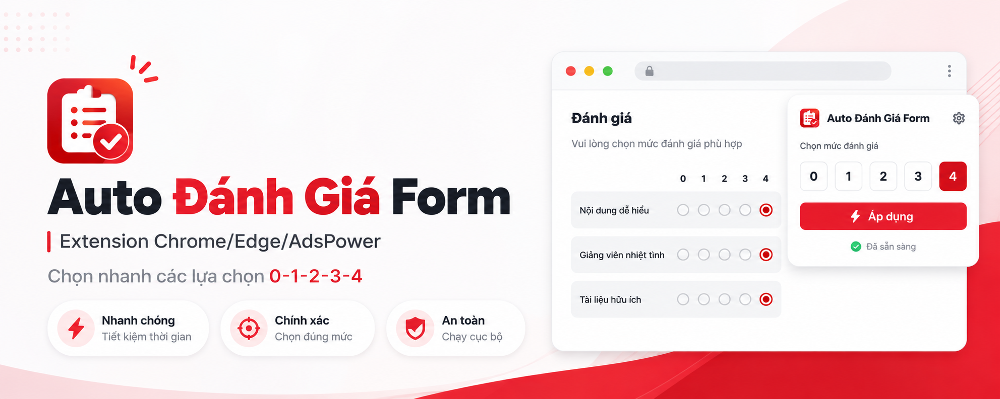
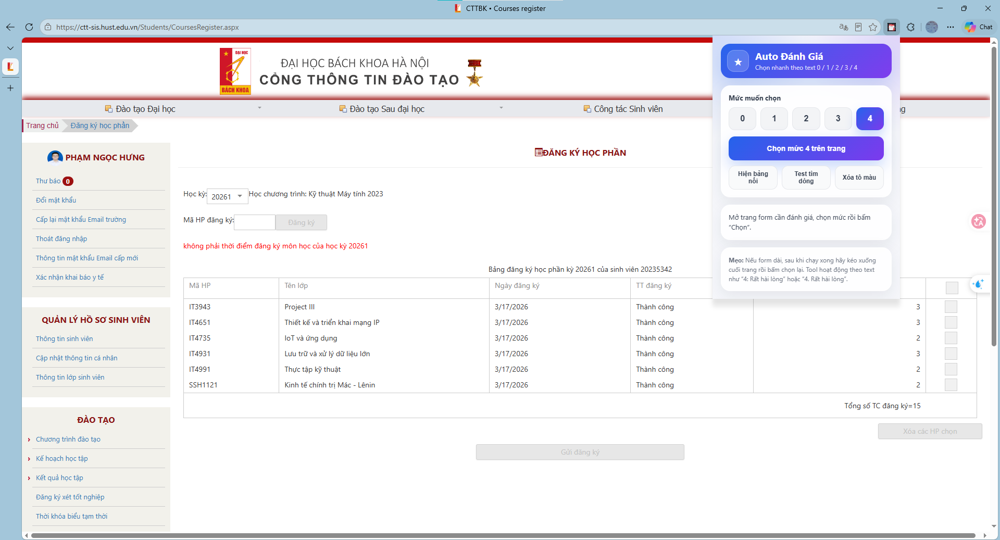

# ⚡ Auto Đánh Giá Form HUST

> Extension Chrome/Edge/AdsPower giúp chọn nhanh các lựa chọn **0 - 1 - 2 - 3 - 4** trên các form đánh giá học phần, khảo sát, phản hồi chất lượng giảng dạy hoặc các form radio có cấu trúc tương tự.

<p align="center">
  
</p>


<p align="center">
  
  
</p>

---

## 📌 Extension này dùng để làm gì?

Khi một form có nhiều câu hỏi với các lựa chọn dạng:

```text
0: Rất không hài lòng
1: Không hài lòng
2: Tạm hài lòng
3: Hài lòng
4: Rất hài lòng
```

hoặc:

```text
0. Không tuân thủ thời gian
1. Hầu như không tuân thủ thời gian
2. Tuân thủ một phần thời gian
3. Tuân thủ tương đối đầy đủ thời gian
4. Tuân thủ đúng thời gian theo quy định
```

bạn có thể chọn nhanh một mức cho toàn bộ các câu hỏi đang hiển thị trên trang, thay vì phải bấm thủ công từng dòng.

---

## 🎬 Demo hướng dẫn

### Ảnh demo

<p align="center">
  
</p>

### Video demo

[](docs/videos/demo.mp4)

<p align="center">
  <b>Click để xem video hướng dẫn.</b>
</p>
---

## ✨ Tính năng chính

| Tính năng | Mô tả |
|---|---|
| 🚀 Chọn nhanh 0 - 1 - 2 - 3 - 4 | Chọn cùng một mức đánh giá cho nhiều câu hỏi trên trang. |
| 🧠 Nhận diện theo text | Không phụ thuộc XPath cố định, phù hợp với nhiều form có giao diện khác nhau. |
| 🧩 Hỗ trợ nhiều kiểu form | Hoạt động với radio HTML thường, label/input và một số form dùng DevExpress/ASP.NET. |
| 📋 Bảng nổi trên trang | Có thể bật panel nhỏ ngay trên website để thao tác nhanh hơn. |
| 🔁 Có thể bấm lại nhiều lần | Nếu form dài hoặc lazy-load, kéo xuống phần mới rồi bấm lại. |
| 🔒 Chạy cục bộ | Extension thao tác trực tiếp trên trang hiện tại, không cần server riêng. |

---

## 🧰 Trình duyệt hỗ trợ

Extension có thể dùng trên các trình duyệt hỗ trợ extension kiểu Chromium:

- Google Chrome
- Microsoft Edge
- AdsPower Browser
- Brave
- Cốc Cốc
- Các browser Chromium khác có mục `Extensions`

> Lưu ý: Extension không chạy trên các trang nội bộ như `chrome://`, Chrome Web Store hoặc một số trang bị trình duyệt chặn script.

---

## 📦 Cài đặt

### Bước 1: Giải nén extension

Giải nén file ZIP ra một thư mục cố định, ví dụ:

```text
auto-rating-extension/
```

Không nên xóa hoặc đổi vị trí thư mục này sau khi đã load vào trình duyệt.

### Bước 2: Mở trang quản lý extension

Trên Chrome/Edge/AdsPower, mở tab mới và nhập:

```text
chrome://extensions
```

Với Edge cũng có thể dùng:

```text
edge://extensions
```

### Bước 3: Bật chế độ nhà phát triển

Bật nút:

```text
Developer mode / Chế độ nhà phát triển
```

thường nằm ở góc trên bên phải.

### Bước 4: Load extension

Bấm:

```text
Load unpacked / Tải tiện ích đã giải nén
```

Sau đó chọn thư mục `auto-rating-extension` vừa giải nén.

### Bước 5: Ghim extension lên thanh công cụ

Bấm biểu tượng mảnh ghép 🧩 trên Chrome, tìm **Auto Đánh Giá Form**, rồi chọn ghim để dễ sử dụng.

---

## 🚀 Cách sử dụng nhanh

1. Mở trang form đánh giá.
2. Bấm icon extension **Auto Đánh Giá Form** trên thanh công cụ.
3. Chọn mức muốn đánh giá: `0`, `1`, `2`, `3` hoặc `4`.
4. Bấm nút **⚡ Chọn mức ... trên trang**.
5. Kiểm tra lại các lựa chọn đã được tick đúng chưa.
6. Kéo xuống phần chưa được chọn nếu form dài, sau đó bấm lại lần nữa.

> Extension chỉ giúp thao tác nhanh hơn. Mức đánh giá vẫn nên là mức bạn thật sự muốn chọn.

---

## 📋 Dùng bảng nổi trên trang

Trong popup extension có nút:

```text
📋 Hiện bảng nổi
```

Khi bấm nút này, một bảng nhỏ sẽ xuất hiện ngay trên website với các nút:

```text
0  1  2  3  4
```

Bạn có thể bấm trực tiếp trên bảng này mà không cần mở lại popup extension nhiều lần.

Gợi ý sử dụng:

- Bấm `4` nếu muốn chọn toàn bộ các mục mức 4 đang hiển thị.
- Kéo xuống dưới nếu form còn phần chưa load.
- Bấm `4` thêm lần nữa để chọn tiếp phần mới xuất hiện.

---

## 🧠 Cách extension nhận diện lựa chọn

Extension **không dùng XPath cố định** như:

```text
/html/body/div[1]/div[2]/table/tr[3]/td/input
```

Vì XPath kiểu đó rất dễ hỏng khi website đổi giao diện.

Thay vào đó, extension quét text hiển thị trên trang và nhận diện các lựa chọn bắt đầu bằng số:

```text
0:
1:
2:
3:
4:
```

hoặc:

```text
0.
1.
2.
3.
4.
```

Sau khi tìm thấy text phù hợp, extension sẽ thử chọn bằng nhiều cách:

1. Dùng API của một số component như DevExpress nếu phát hiện được.
2. Click vào `label` hoặc `input[type="radio"]` nếu form dùng HTML thường.
3. Click theo vị trí dòng text trên màn hình nếu form custom giao diện.

Nhờ vậy extension linh hoạt hơn khi đem sang các form tương tự.

---

## ✅ Form phù hợp

Extension thường hoạt động tốt với các form có lựa chọn dạng:

```text
0: ...
1: ...
2: ...
3: ...
4: ...
```

```text
0. ...
1. ...
2. ...
3. ...
4. ...
```

```text
4 Rất hài lòng
3 Hài lòng
2 Bình thường
1 Không hài lòng
0 Rất không hài lòng
```

---

## ⚠️ Trường hợp có thể không hoạt động

Một số website có thể chặn hoặc làm extension hoạt động không ổn định nếu:

- Form nằm trong `iframe` khác domain.
- Lựa chọn không có text dạng `0`, `1`, `2`, `3`, `4`.
- Website chỉ load một phần câu hỏi khi scroll.
- Website dùng Shadow DOM hoặc component custom quá đặc biệt.
- Trang chặn script từ extension.

Cách xử lý nhanh:

1. Kéo xuống phần chưa được tick rồi bấm lại.
2. Refresh trang rồi thử lại.
3. Dùng nút bảng nổi để thao tác trực tiếp trên trang.
4. Kiểm tra xem text lựa chọn có đúng dạng `4:` hoặc `4.` không.

---

## 🛠️ Cấu trúc thư mục

```text
auto-rating-extension/
├── manifest.json
├── popup.html
├── popup.css
├── popup.js
└── README.md
```

Nếu bạn muốn thêm ảnh/video hướng dẫn, có thể tạo thêm thư mục:

```text
auto-rating-extension/
└── docs/
    └── images/
        ├── banner.png
        ├── demo-screenshot.png
        ├── video-thumbnail.png
        └── demo.gif
```

## ❓ Câu hỏi thường gặp

### 1. Bấm rồi nhưng chỉ chọn được một phần form?

Có thể form đang lazy-load, nghĩa là chỉ render phần đang nhìn thấy. Hãy kéo xuống dưới rồi bấm chọn lại.

### 2. Có dùng được cho form khác không?

Có, miễn là form đó có lựa chọn dạng text bắt đầu bằng `0`, `1`, `2`, `3`, `4` và dùng radio/label hoặc component tương tự.

### 3. Extension có tự gửi form không?

Không. Extension chỉ hỗ trợ chọn lựa chọn. Bạn vẫn cần kiểm tra lại và tự bấm nút gửi nếu muốn.

### 4. Có lưu dữ liệu cá nhân không?

Không theo thiết kế hiện tại. Extension thao tác trên trang đang mở và không cần server riêng.

### 5. Tại sao không dùng XPath?

Vì XPath cố định rất dễ hỏng khi website đổi layout. Cách nhận diện theo text giúp extension linh hoạt hơn.

---

## 🔐 Quyền riêng tư

Extension được thiết kế để chạy cục bộ trên trình duyệt. Mục tiêu là tự động hóa thao tác click trên form đang mở.

Extension không cần:

- Tài khoản riêng
- API key
- Server trung gian
- Gửi dữ liệu form ra ngoài

Bạn nên tự kiểm tra lại mã nguồn trước khi sử dụng trên các trang có dữ liệu nhạy cảm.

---

## 🧪 Kiểm tra sau khi chọn

Sau khi bấm chọn mức đánh giá, nên kiểm tra nhanh:

- Các câu hỏi đã được tick đúng mức chưa.
- Có câu nào bị bỏ sót không.
- Có phần form nào cần kéo xuống để load tiếp không.
- Có câu hỏi nào cần đánh giá khác mức chung không.

---

## 📝 Ghi chú sử dụng có trách nhiệm

Extension giúp tiết kiệm thời gian thao tác lặp lại. Người dùng vẫn nên đọc nội dung form và chọn mức đánh giá phù hợp với ý kiến thực tế của mình.

---

## 📄 License

Bạn có thể chỉnh sửa, sử dụng nội bộ hoặc chia sẻ lại tùy nhu cầu. Nếu public lên GitHub, nên bổ sung file `LICENSE` rõ ràng, ví dụ MIT License.

---

## 📌 Changelog

### v1.0.0

- Chọn nhanh mức `0 - 1 - 2 - 3 - 4`.
- Nhận diện lựa chọn theo text hiển thị.
- Hỗ trợ popup extension.
- Hỗ trợ bảng nổi trên trang.
- Thử nhiều cơ chế chọn: DevExpress API, radio/label, click theo vị trí text.
